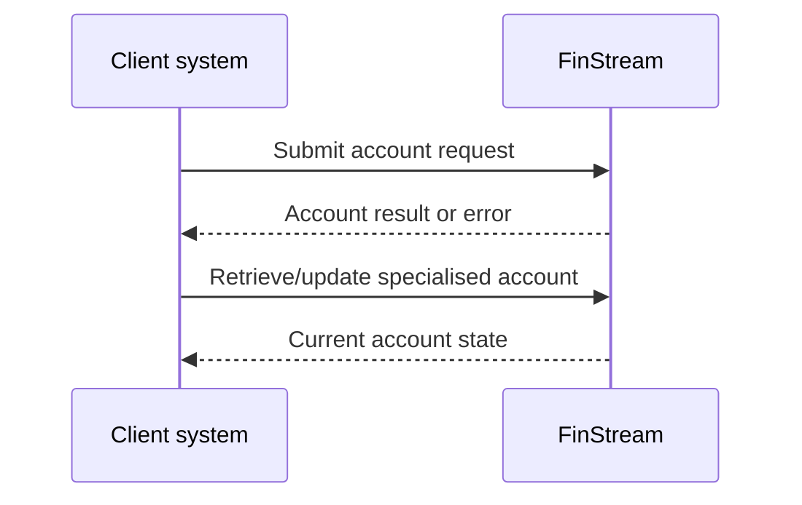

# Integration workflows

Future workflow: obtain access token → submit versioned request with idempotency key → receive result → reconcile safely on timeout. Events/webhooks are not currently provided.
