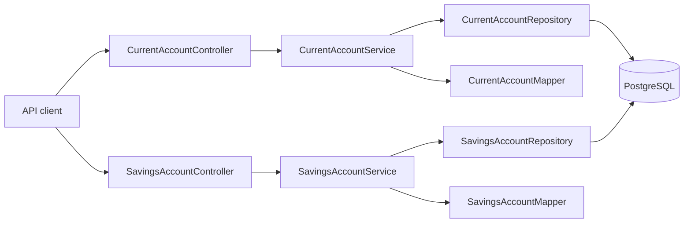

# Architecture overview

## Current architecture — confirmed

The Account service is a Spring Boot application on port 8080. Each subtype has an HTTP controller, a specialised service, a MapStruct mapper, and a Spring Data JPA repository. Both subtype entities share the `Account` base entity using JPA `JOINED` inheritance. PostgreSQL is the configured data store. Liquibase changelogs define the initial tables, although Hibernate `ddl-auto: update` is also enabled, creating a production risk.

## Target architecture — proposed

Use an API gateway and OIDC identity provider once external clients require shared identity/routing. Keep Account data owned by Account service. Add Customer, Transaction, Ledger, Payment, Notification, and Audit services only when their business capabilities need independent ownership. Use durable domain events via an outbox; never rely on a database transaction spanning services.

## Principles and trade-offs

Database-per-service prevents accidental cross-service coupling but adds operational cost. Event-driven integration reduces direct dependency but is eventually consistent and demands idempotent consumers. The current inheritance hierarchy reduces duplicated CRUD code; composition/use-case services are more flexible when behaviours diverge.
