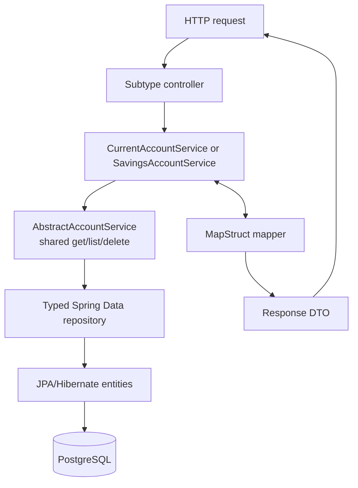

# Account-service component architecture

Controllers translate HTTP only; they currently duplicate CRUD routes rather than extend the unused `AccountControllerContract`. Services orchestrate CRUD and subtype operations. The abstract service provides generic reads/deletes. Mappers convert entities and DTOs. Repositories abstract persistence.

Production recommendation: retain a small shared CRUD helper only while rules are truly identical; move meaningful actions into explicit use-case services (`CreateCurrentAccount`, `ChangeInterestRate`). Avoid controller inheritance: Spring MVC mappings and security policies become difficult to reason about when inherited.
