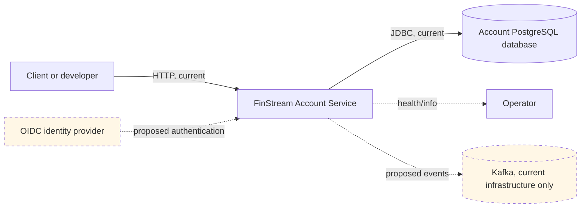

# System context

**Trust boundary:** an unauthenticated client can currently reach the Account service directly. PostgreSQL credentials are present in configuration. This is acceptable only for local development.

Legend: solid arrows are confirmed interactions; dashed arrows are proposed. There is no external Customer service or identity integration in this repository.
