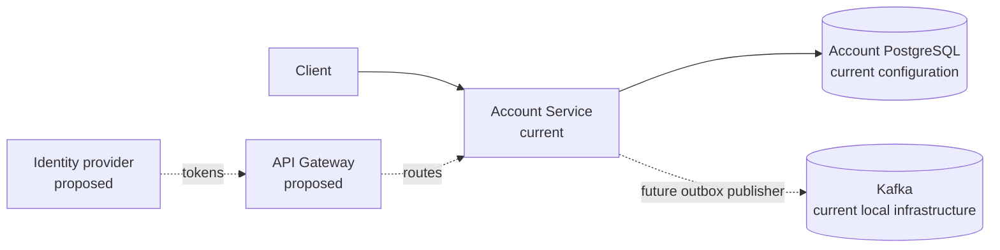

# C4 Level 2 — Containers

```mermaid
flowchart LR
  Client --> AS[Account Service\ncurrent]
  AS --> DB[(Account PostgreSQL\ncurrent configuration)]
  Kafka[(Kafka\ncurrent local infrastructure)]
  AS -. future outbox publisher .-> Kafka
  GW[API Gateway\nproposed] -. routes .-> AS
  ID[Identity provider\nproposed] -. tokens .-> GW
```
