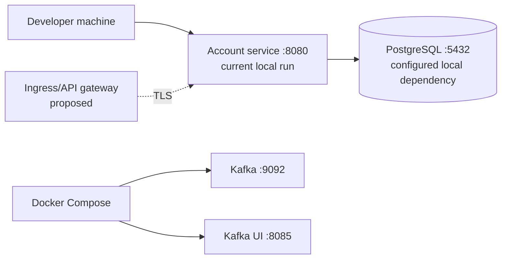

# Deployment and network view

```mermaid
flowchart LR
  Dev[Developer machine] --> App[Account service :8080\ncurrent local run]
  App --> Pg[(PostgreSQL :5432\nconfigured local dependency)]
  Docker[Docker Compose] --> Kafka[Kafka :9092]
  Docker --> UI[Kafka UI :8085]
  Ingress[Ingress/API gateway\nproposed] -. TLS .-> App
```

Compose currently starts Kafka and Kafka UI only; it does not deploy the Account service or PostgreSQL.
