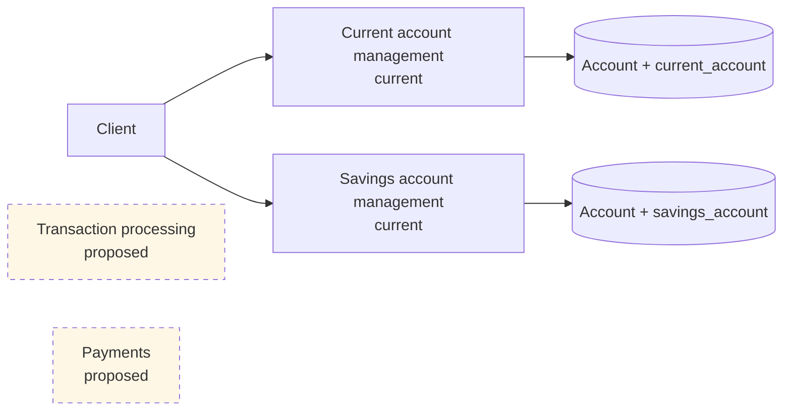

# DFD Level 1

```mermaid
flowchart LR
  Client --> CA[Current account management\ncurrent]
  Client --> SA[Savings account management\ncurrent]
  CA --> DB[(Account + current_account)]
  SA --> DB2[(Account + savings_account)]
  TX[Transaction processing\nproposed]:::future
  PAY[Payments\nproposed]:::future
  classDef future stroke-dasharray: 5 5,fill:#fff7e6
```
