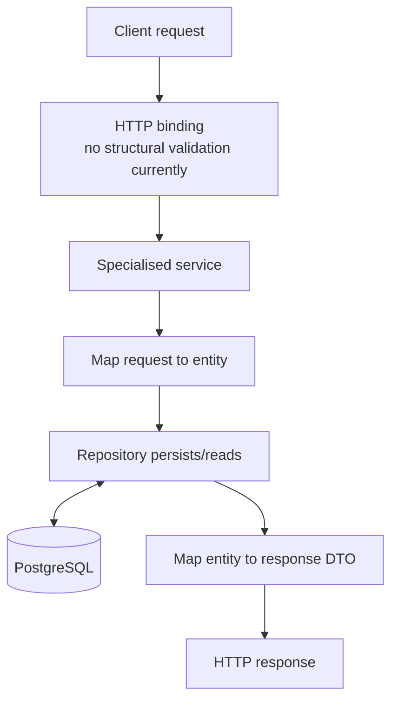

# DFD Level 2 — Account operations

Retrieval skips the input-mapping step. Update loads the subtype, maps request fields onto it, then saves. Delete checks existence then deletes. No explicit `@Transactional` boundary is declared; Spring Data repository methods supply individual transactional behaviour, not an explicit business transaction design.
