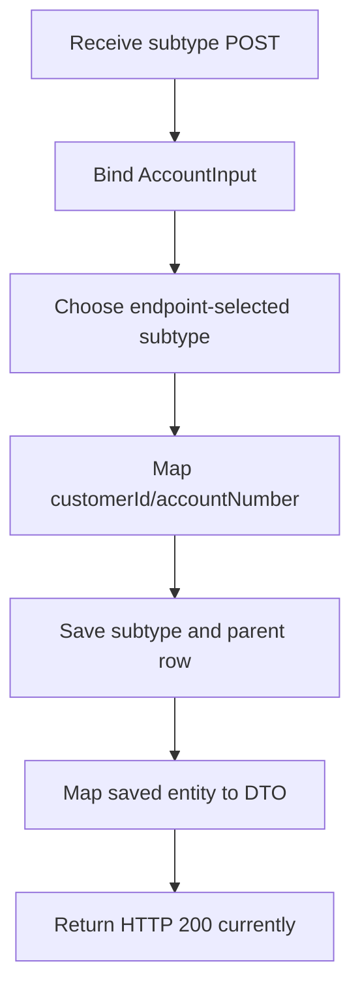

# DFD Level 3 — Create account

Important gap: `status`, overdraft limit, and interest rate are not supplied by `AccountInput`; subtype fields are initially null and status may violate the non-null schema constraint. Request validation, initial-status policy, duplicate handling, and `201 Created`/`Location` semantics are recommended.
