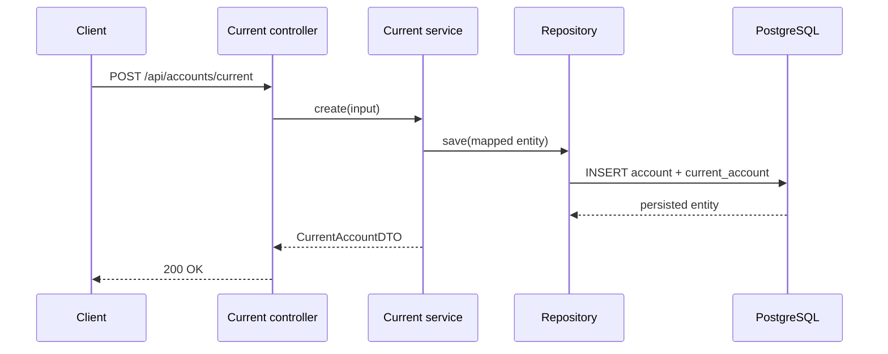
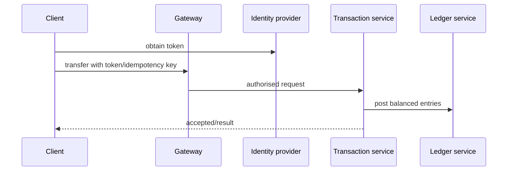

# Sequence diagrams

## Create current account (current)

For get/update/delete, the controller calls the specialised service, which queries/saves/deletes through its repository. Current specialised operations retrieve or update `overdraftLimit`; savings specialised operations retrieve or update `interestRate`.

## Future authenticated transaction

This is proposed, not implemented.
