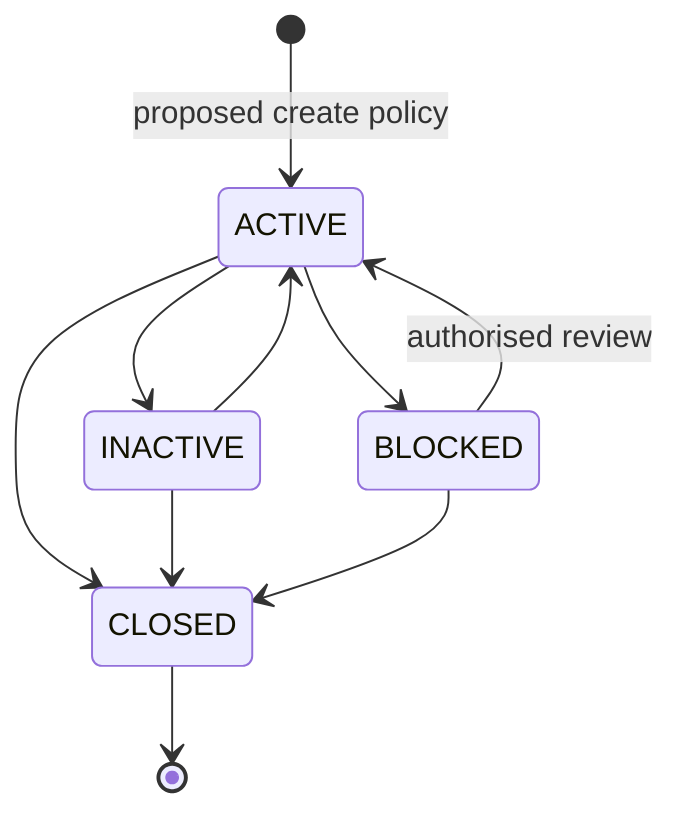

# State diagrams

## Account lifecycle

All four state names are confirmed in `AccountStatus`; allowed transitions are proposed because the service does not enforce them. Transaction and payment state diagrams are deferred until those domains exist.
