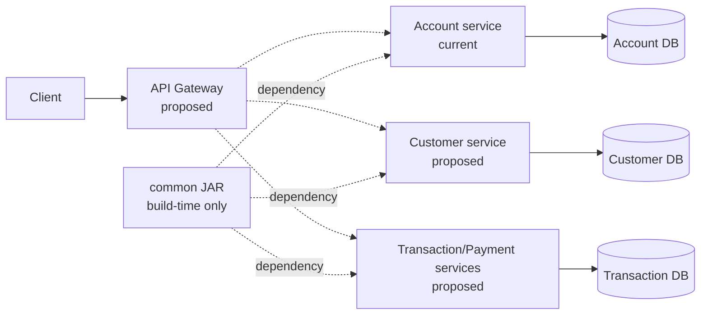

# Runtime architecture, boundaries, and reliability

## Runtime system design

`common` is build-time code, not a runtime container. Current runtime implementation is Account + PostgreSQL. Gateway, Customer, Transaction, Payment, Notification, and broker communication are proposed.

Synchronous HTTP should serve immediate query/command needs with authenticated identity, timeout, bounded retry only for safe operations, and clear failure semantics. Asynchronous events should publish durable business facts using an outbox, idempotent consumers, retry/DLQ policy, ordering key, and schema versioning. Transactions/payment flows shown above are future design—not current implementation.

## Data ownership

Use database-per-service: Account owns Account schema/data; Customer owns Customer; Transaction owns its own ledger/transaction data. The word “database” can mean a separate physical database or an isolated schema/credentials initially, but no service may query another service’s tables directly. Shared database is quicker at first but creates hidden coupling, coordinated migrations, security leakage, and unclear ownership.

## Observability and reliability placement

Root governs dependency versions and build conventions. Common supplies lightweight logging/correlation contracts or an opt-in starter. Services name business metrics, define readiness based on their actual dependencies, set per-call timeouts/idempotency, and avoid logging secrets. Infrastructure collects logs/traces/metrics and supplies dashboards, alerting, broker/database availability, and secret management.

Retries, circuit breakers, bulkheads, and rate limits are not universal defaults: a retry can duplicate a payment, while an idempotent read may safely retry. Each service operation owns its policy; platform libraries provide consistent mechanisms and telemetry. Health endpoints must not claim readiness when a required database/broker is unusable.

## Contract strategy

Do not put all DTOs in Common. Shared DTOs couple service release cycles and often become accidental canonical domain models. Keep service request/response types with their API/OpenAPI contract. Share only stable cross-service envelopes/errors where governance is strong; publish versioned OpenAPI, consumer-driven contract tests, generated clients where useful, and separately versioned event schemas for asynchronous facts.

## Architectural rules and anti-patterns

1. A service never accesses another service’s database or imports its internal Java packages.
2. Dependency versions are managed centrally; usage is declared locally.
3. Common contains only stable platform infrastructure/contracts, never service business logic, JPA entities, repositories, or migrations.
4. Each service owns its APIs, domain, data, migrations, and authorisation decisions.
5. APIs/events must be versionable and compatible changes must be tested.
6. Every service follows correlation, error, security, and telemetry conventions.
7. No circular Maven dependencies; enforce dependency direction with architecture tests.

Anti-pattern prevention: review every Common addition for two real consumers and a stable owner; use a published compatibility policy; split oversized modules; use service-specific YAML; forbid shared repositories/entities; and use API/event contracts instead of direct code/database reuse.
