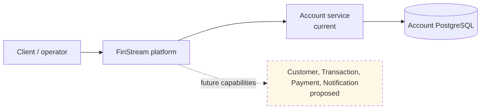
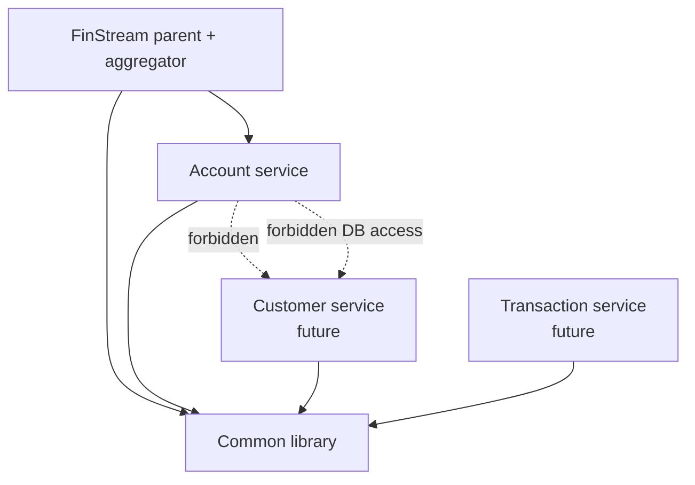
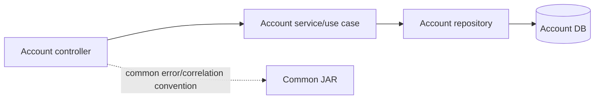
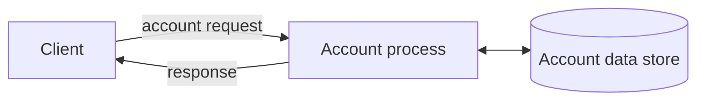

# C4, dependency, and DFD diagrams

## C4 Level 1 — context

## C4 Level 2 / dependency direction

The Common edge is a build-time dependency; it is not an inter-service runtime call.

## C4 Level 3 — Account using Common

## DFD Level 0–3

Level 1 separates Account (current) from Customer/Transaction/Payment/Notification (proposed). Level 2 Account flow is client → controller → validation/use case → repository → Account data store → response. Level 3 create account is validate request → authorise customer access (proposed) → apply account rules → persist local transaction → map result → audit/outbox event (proposed) → response. Future transfer flow must coordinate Transaction and Ledger through local commits plus Saga/outbox, not a cross-service database transaction.
