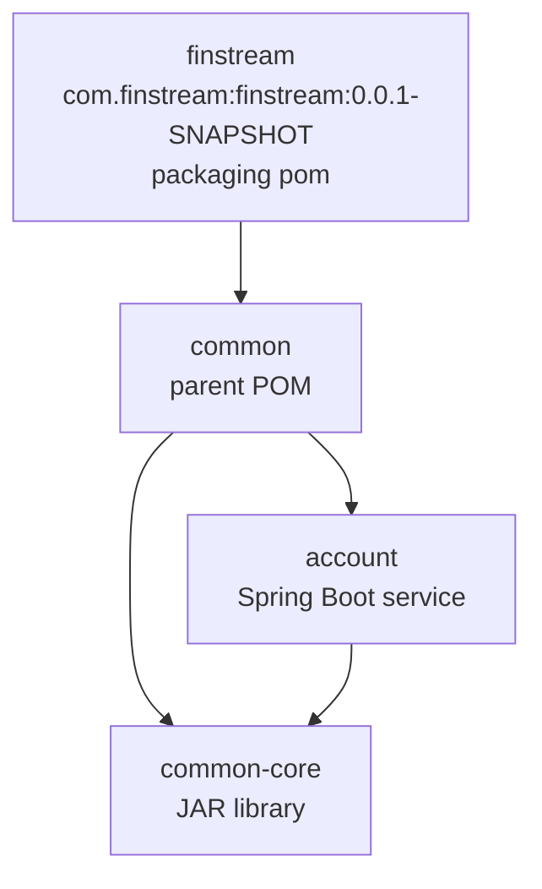

# Maven hierarchy and dependency governance

## Current build topology

The root is both a **parent** and an **aggregator**. As a parent, its POM settings are inherited by children; as an aggregator, its `<modules>` list lets Maven build related projects together. These are separate roles: a parent may be remote/non-aggregating, and an aggregator need not be a parent.

A **module** is a project included in the reactor. A **dependency** is an artifact a project needs on its classpath—Account depends on Common Core. The **Maven reactor** reads the module graph, topologically orders it, then builds Common and Common Core before Account. `packaging=pom` produces no application JAR: it is correct for parent/aggregation POMs and explains why neither root nor Common is a Spring Boot application.

Coordinates identify projects/artifacts: group ID is the organisation namespace, artifact ID is the module name, and version is the release identity. Thus `com.finstream:finstream:0.0.1-SNAPSHOT` identifies the root POM, `com.finstream:common:0.0.1-SNAPSHOT` the intermediate parent POM, and `com.finstream:common-core:0.0.1-SNAPSHOT`/`com.finstream:account:0.0.1-SNAPSHOT` the JAR artifacts.

`relativePath` tells Maven where to find a parent during local/reactor builds. `../pom.xml` is appropriate for direct children; an empty `<relativePath/>` on the root tells Maven to resolve Spring Boot’s parent from repositories rather than a local file.

## Inheritance, management, and usage

`dependencyManagement` supplies a version and policy when a child chooses a dependency; it does not put that dependency on every child’s classpath. `<dependencies>` declares actual classpath usage. Keep Spring Web in Account because Account exposes HTTP; do not put it in root dependencies merely because another service may use it.

This distinction prevents dependency drift: central ownership gives one compatible version of PostgreSQL/MapStruct/Springdoc while each service has only the capabilities it uses. Duplicate child versions lead to unreviewed divergence, inconsistent CVE remediation, and harder upgrades.

Root responsibilities: Java version; Spring Boot baseline; managed third-party versions; plugin management; compiler/annotation-processing standards; module registration; test, quality, and release conventions. Service responsibilities: declare their own web/data/security/messaging capabilities, configuration, migrations, application entry point, domain/API logic, and tests.

The Account-parent mismatch has been corrected. For a reactor-wide development release, use a single `${revision}` property when release automation needs it.
